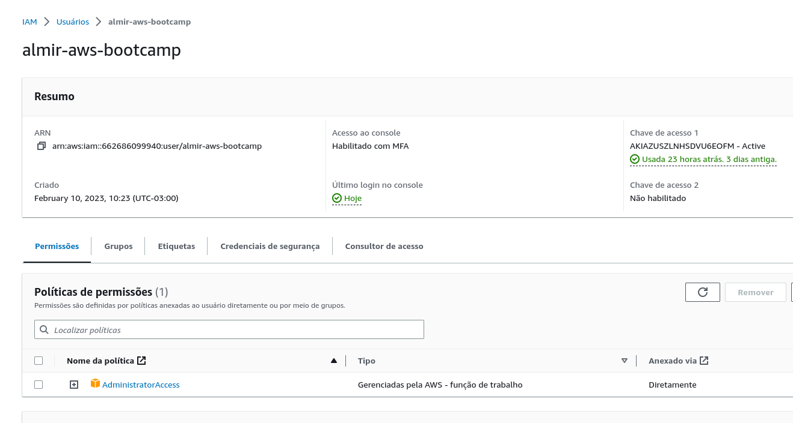
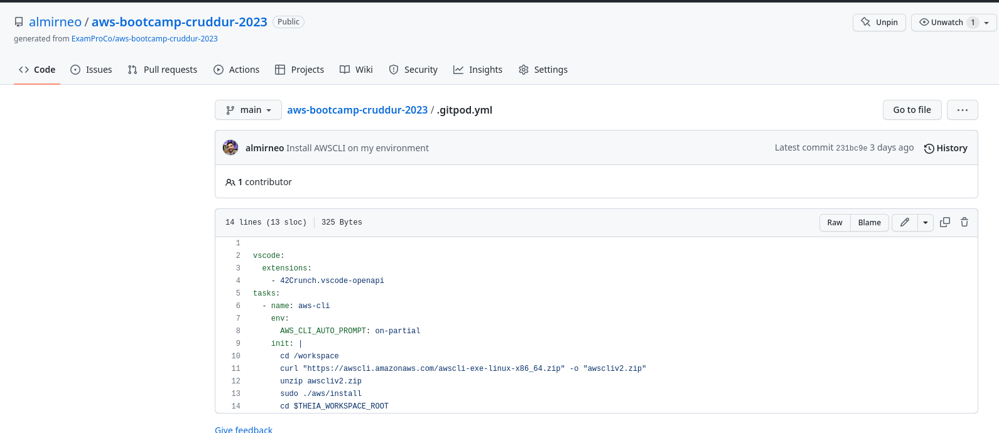
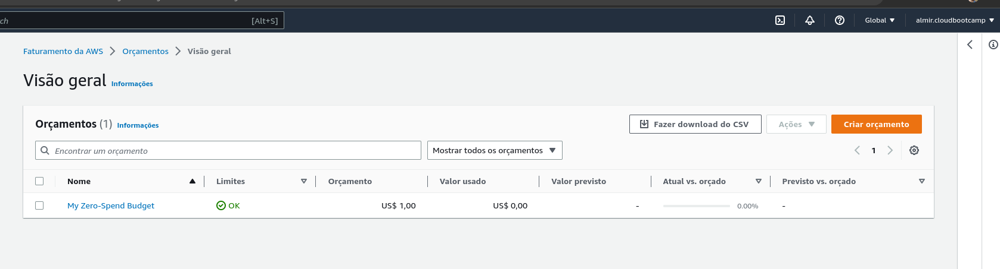
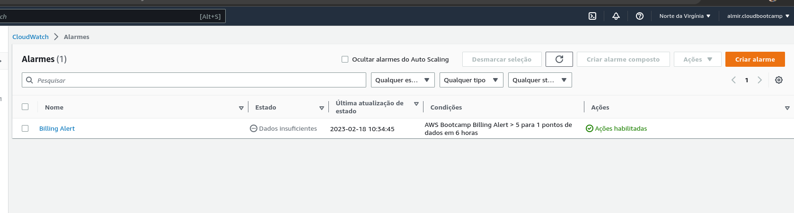
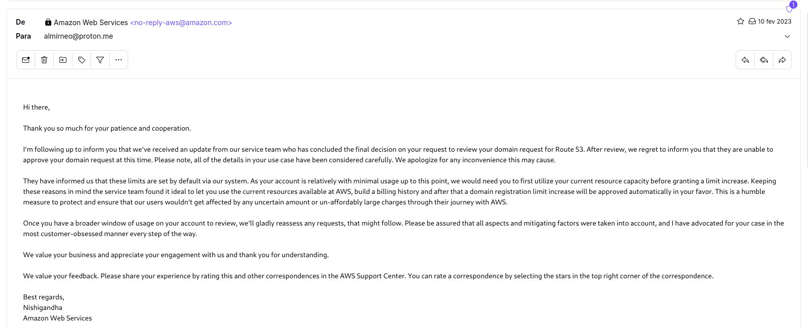

# Week 0 — Billing and Architecture

## Required HomeWork/Tasks

### Create a User Admin

I created a User Admin and enable MFA.

### Install AWS CLI - GITPOD

I was able to use GitPod with AWS CLI.

I only have difficulty making commits through GitPod, but it was already corrected, it was the lack of permissions.

### Create a Budget

I created my own Budget.

### Create Billing Alarm

I created my own Billing Alarm.

### Open a Ticket Support

 I opened the ticket with the support of Amazon requesting the qualification to record a domain through Route 53, their answer is that due to security and the account to be new I would have to wait a while to use this feature.
 
 
 
 ### Recreate Logical Conceptual Diagram - Lucid Chart
 
 
 
 [Lucid Charts Share Link](https://lucid.app/lucidchart/f2405c44-9471-480f-b405-78349c413d54/edit?invitationId=inv_df6d064a-5272-45f1-9d2e-e4da29179662)
 
 ### Recreate Logical Diagram - Lucid Chart
 
 
 
 [Lucid Chart Share Link](https://lucid.app/lucidchart/3e677626-e614-4736-8df1-e2d93a5d72a3/edit?invitationId=inv_2cc42852-39a1-41b0-b6fb-c171e762b686)
