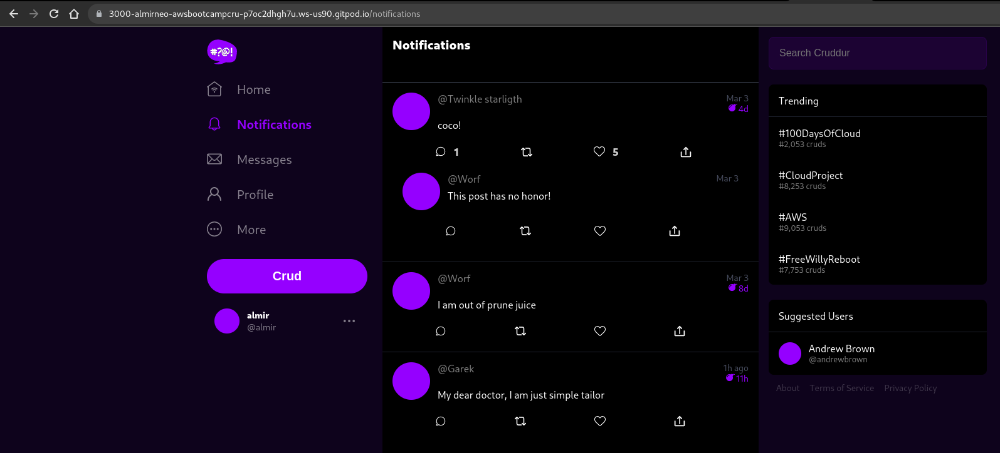
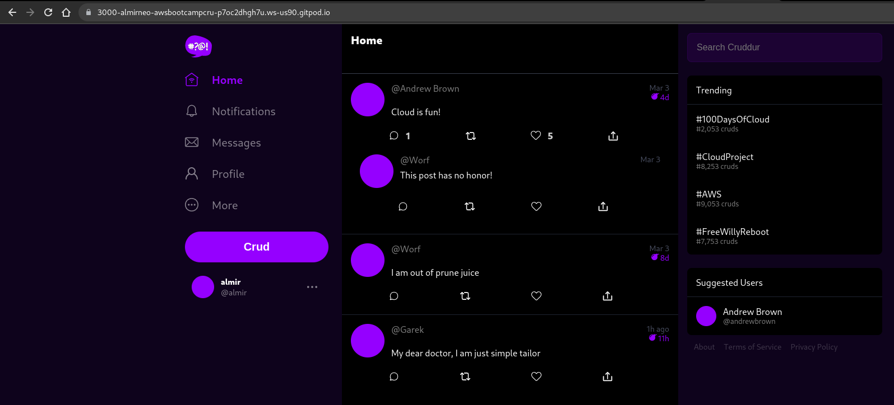
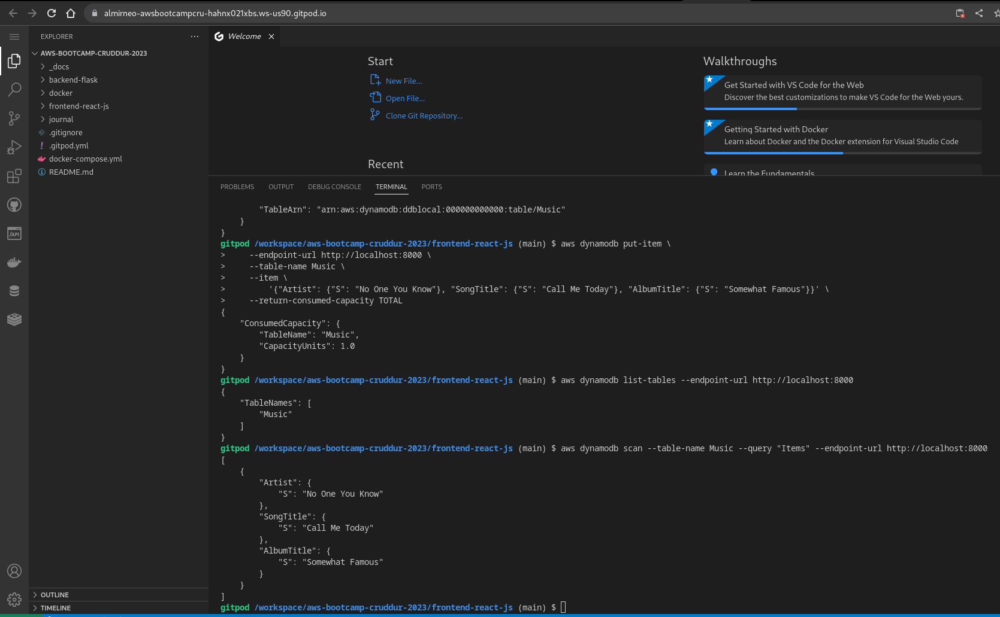
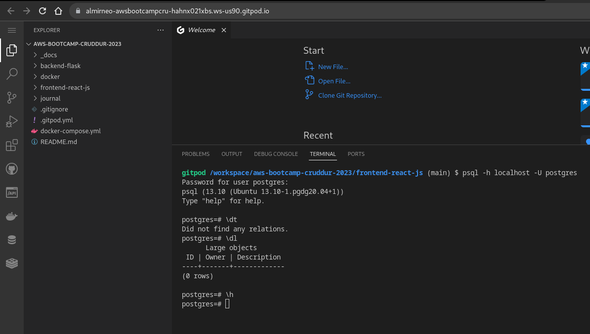
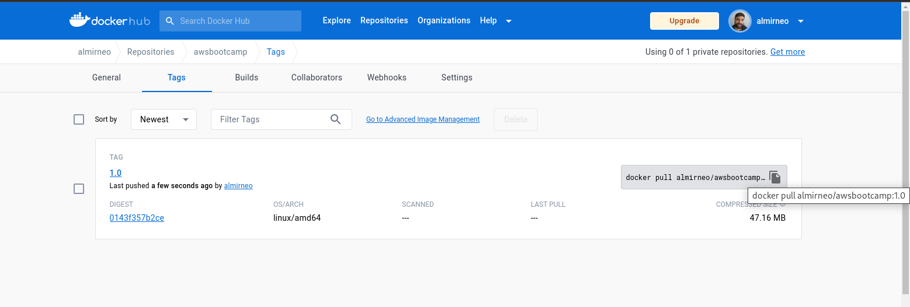
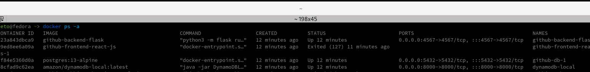
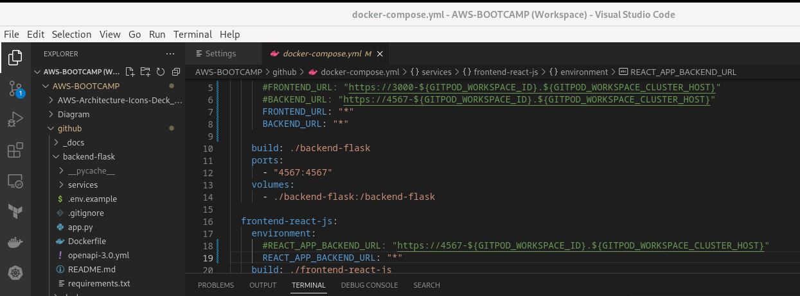
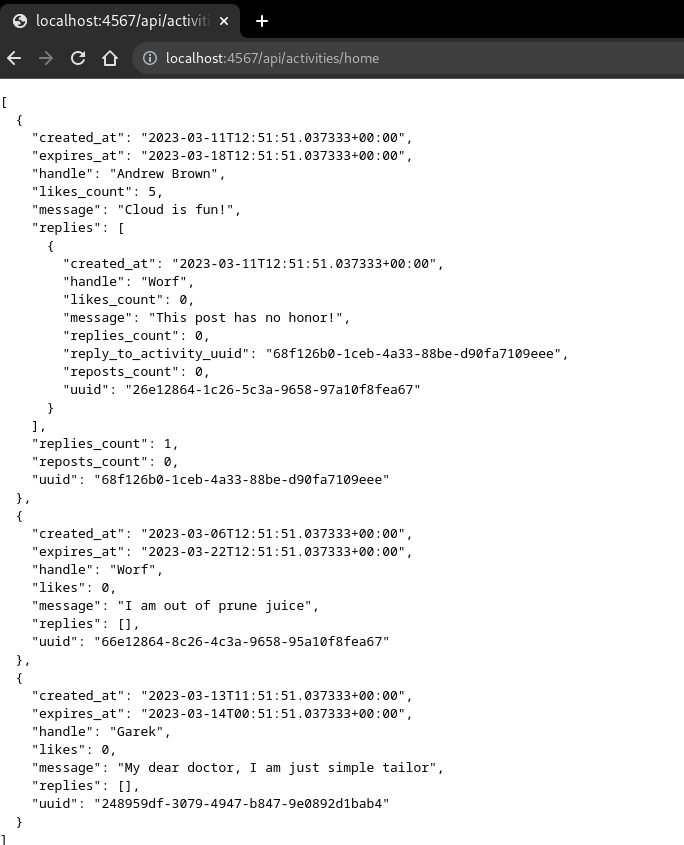
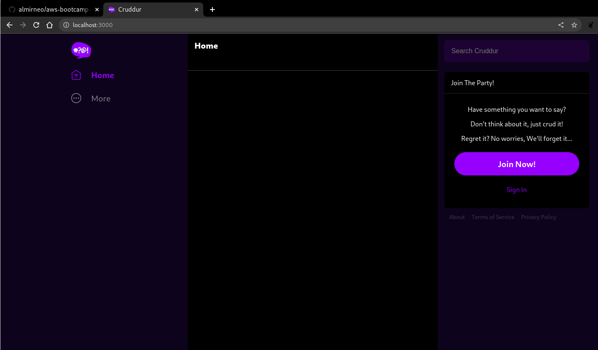
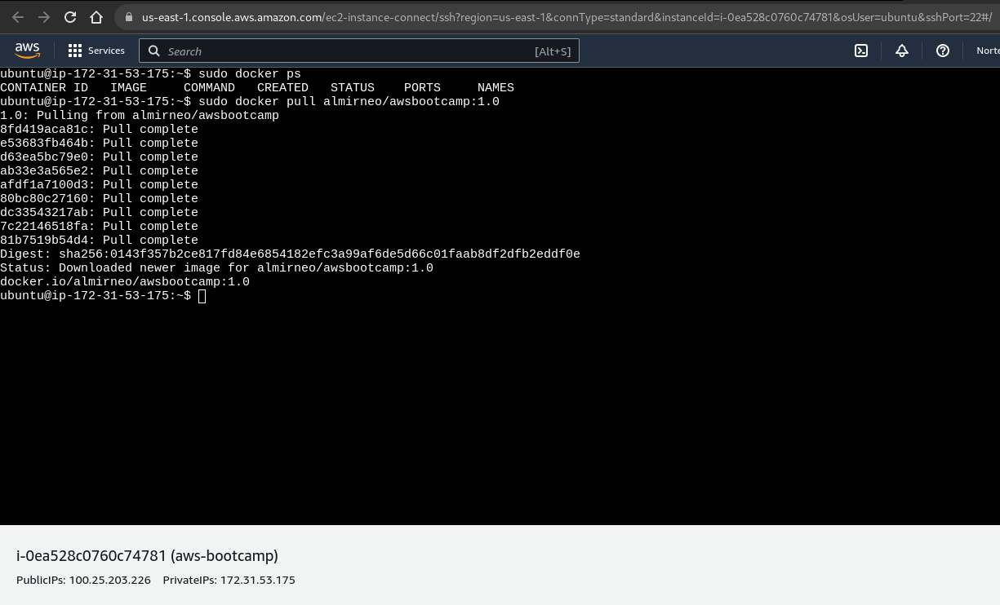

# Week 1 — App Containerization

## Required HomeWork/Tasks

### Containerize Application (Dockerfiles, Docker Compose)

I was able to successfully carry out the Containerize Application following the video guidance.

### Write a Flask Backend Endpoint for Notifications and React Page for Notifications

I was successfully able to add the endpoints and notification page.

### Run DynamoDB Local and PostgreSQL local

I was successfully able to run both of database.

## Homework Challenges

### Push and Tag a image to DockerHub

I pushed a image to DockerHub.

### Install Docker on your loalmachine

I already had docker installed on my personal machine.
I configured it via git and downloaded the entire repository locally, and built the images.

I needed to change the environment variables, initially I couldn't get the frontend to run successfully.
I realized that I needed to install the npm manager and install the packages from the frontend directory.
After that, it was possible to upload the entire environment using Docker Compose.

### Launch an EC2 Instance that has docker installed and pull a container

I launched an EC2 instance and used bootstrap to install docker and was able to use the image I uploaded on Docker Hub.

